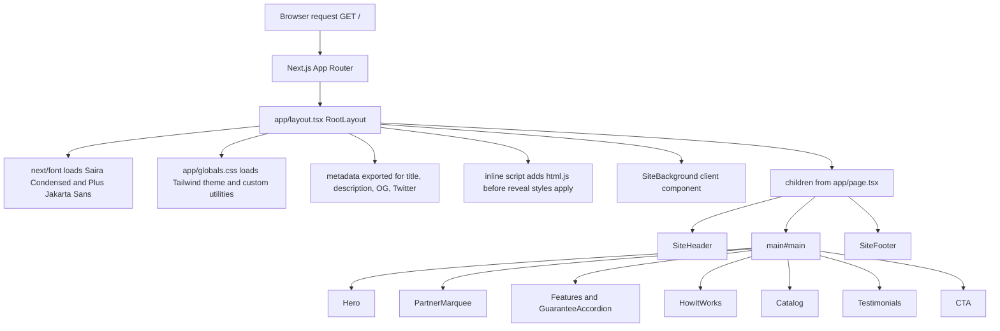
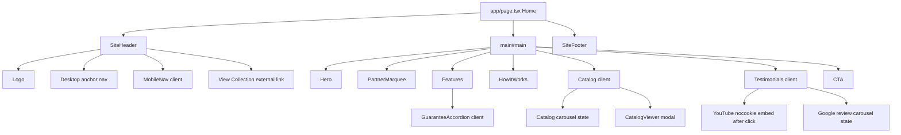
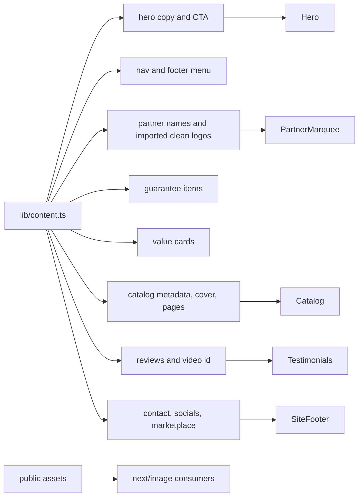
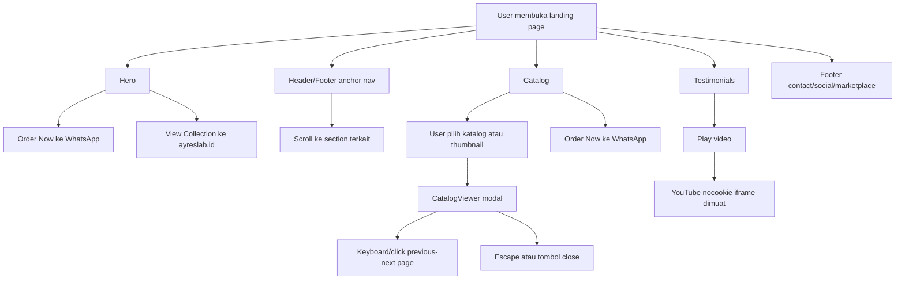
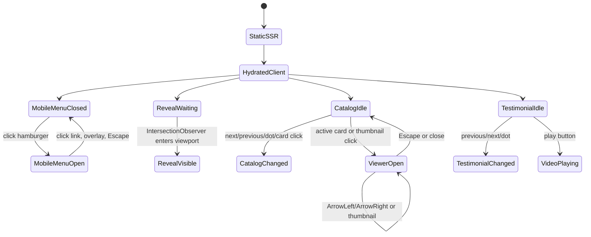
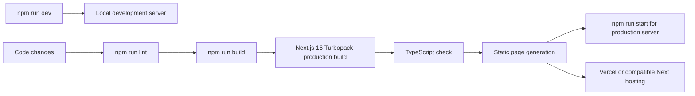

# Ayres Apparel Landing Page

Dokumentasi ini menjelaskan flow project `lp-ayres`, struktur aplikasi, alur render, alur interaksi user, dependency utama, audit teknis, dan cara menjalankan project. README lama masih berupa template `create-next-app`, sehingga file ini diganti penuh agar sesuai dengan kondisi project saat ini.

## Ringkasan

`lp-ayres` adalah landing page untuk Ayres Apparel, brand custom jersey dan apparel di Yogyakarta. Aplikasi memakai Next.js App Router, React, TypeScript, Tailwind CSS, dan aset visual lokal untuk menampilkan hero, partner logo, value proposition, katalog jersey, testimoni, CTA WhatsApp, marketplace, dan footer kontak.

Karakter project:

- Single-page landing page di route `/`.
- Konten marketing utama terpusat di `lib/content.ts`.
- UI dibagi per section di `components/sections`.
- Aset gambar katalog, jersey, logo, dan partner disimpan di `public`.
- Interaksi client-side dibatasi pada menu mobile, reveal animation, accordion, katalog viewer, testimoni, dan background WebGL.
- Build produksi saat audit menghasilkan route statis untuk `/`, `/_not-found`, dan `/icon.png`.

## Stack

| Area | Teknologi |
| --- | --- |
| Framework | Next.js `16.2.7` App Router |
| UI runtime | React `19.2.4`, React DOM `19.2.4` |
| Bahasa | TypeScript strict mode |
| Styling | Tailwind CSS `4`, `@tailwindcss/postcss`, global theme di `app/globals.css` |
| Image | `next/image` untuk local image optimization |
| Icon | `lucide-react`, `simple-icons`, custom SVG social icons |
| Visual effect | `ogl` untuk WebGL ferrofluid background |
| Utility class | `clsx`, `tailwind-merge` |
| Package manager | npm, dengan lockfile `package-lock.json` |

## Struktur Direktori

```text
D:\lp-ayres
|-- app
|   |-- layout.tsx        # Root layout, metadata, fonts, global CSS, background
|   |-- page.tsx          # Route "/" dan urutan section landing page
|   |-- globals.css       # Tailwind v4 theme, utilities, animations, base style
|   `-- icon.png          # App icon route
|-- components
|   |-- decoration        # Background WebGL, marquee, social icons
|   |-- sections          # Section landing page: header, hero, catalog, CTA, footer
|   |-- ui                # Primitive UI: button, container, heading, badge, input
|   |-- logo.tsx          # Wordmark link
|   `-- reveal.tsx        # Scroll reveal progressive enhancement
|-- lib
|   |-- content.ts        # Single source of truth untuk copy, link, katalog, review
|   `-- utils.ts          # cn() helper untuk merge className
|-- public
|   |-- catalog           # Aset katalog yang dipakai oleh UI
|   |-- jersey            # Foto jersey hero/social proof
|   |-- logo_partner      # Logo partner original dan versi clean
|   |-- ayres-logo.png
|   |-- ayres-wordmark.png
|   `-- tokopedia.png
|-- next.config.ts
|-- postcss.config.mjs
|-- eslint.config.mjs
|-- tsconfig.json
|-- package.json
`-- package-lock.json
```

## Flow Request dan Render



Penjelasan:

- `app/layout.tsx` adalah root layout wajib App Router. File ini membungkus semua route dengan `<html>` dan `<body>`.
- `app/page.tsx` adalah satu-satunya halaman publik utama dan merender landing page secara berurutan.
- Mayoritas komponen berjalan sebagai Server Component karena tidak memakai `"use client"`.
- Client Component hanya dipakai saat butuh state, event handler, browser API, IntersectionObserver, window/document, atau WebGL.
- Build production mem-prerender route `/` sebagai static content.

## Flow Komponen Landing Page



## Flow Konten dan Aset



Prinsip maintenance:

- Ubah copy, link CTA, katalog, review, partner, footer, dan marketplace lewat `lib/content.ts`.
- Tambah gambar katalog yang dipakai UI ke `public/catalog/<slug>`.
- `public/katalogv2` saat ini tampak sebagai kumpulan aset sumber/arsip dan tidak langsung dipakai oleh UI utama.
- Untuk logo partner, UI memakai versi clean dari `public/logo_partner/clean`.
- Import statis gambar partner/hero membantu Next mengetahui dimensi gambar dan mengurangi layout shift.

## Flow Interaksi User



CTA eksternal yang penting:

- WhatsApp order: `https://api.whatsapp.com/send/?phone=6287818310416...`
- Collection: `https://ayreslab.id/`
- Marketplace: Shopee dan Tokopedia dari `footer.marketplaces`.
- Social media: Facebook, Instagram, YouTube, TikTok dari `footer.socials`.

## Flow Client-Side State



Client Component yang ada:

| File | Alasan client-side |
| --- | --- |
| `components/sections/mobile-nav.tsx` | `useState`, keyboard Escape, document event |
| `components/reveal.tsx` | `IntersectionObserver`, DOM class manipulation |
| `components/sections/guarantee-accordion.tsx` | Accordion state |
| `components/sections/catalog.tsx` | Carousel state, modal state, keyboard control, body scroll lock |
| `components/sections/testimonials.tsx` | Video play state dan review carousel |
| `components/decoration/site-background.tsx` | `useSyncExternalStore`, `window.matchMedia` |
| `components/decoration/ferrofluid.tsx` | WebGL canvas, resize observer, animation frame |

## Styling Flow

```mermaid
flowchart TD
  CSS[app/globals.css] --> Theme[@theme color, shadow, font, animation tokens]
  CSS --> Base[@layer base html, body, headings, focus]
  CSS --> Utilities[@utility glass, hairline, text-gradient-red, mask-fade-x]
  CSS --> RevealCSS[.js .reveal hidden state and .is-visible]
  CSS --> ReducedMotion[prefers-reduced-motion overrides]
  Layout[app/layout.tsx] --> CSS
  Components[Components] --> Tailwind[Utility classes and theme tokens]
```

Catatan styling:

- Theme dominan adalah dark cinematic sport: black, red accent, glass surface, athletic condensed heading.
- Font heading memakai `Saira_Condensed`; body memakai `Plus_Jakarta_Sans`.
- Reveal animation hanya menyembunyikan elemen saat class `html.js` sudah ditambahkan, sehingga konten tetap terlihat jika JavaScript mati.
- `prefers-reduced-motion` menghentikan animasi berat dan SiteBackground juga mem-pause WebGL.

## Build dan Deployment Flow



Command utama:

```bash
npm install
npm run dev
npm run lint
npm run build
npm run start
```

Port development default Next adalah `http://localhost:3000`.

## Audit Teknis

Audit ini dilakukan pada 2026-07-03 terhadap kode lokal di `D:\lp-ayres`.

### Status Verifikasi

| Pemeriksaan | Hasil |
| --- | --- |
| `npm run lint` | Lulus |
| `npm run build` | Lulus |
| Next build | Next.js `16.2.7` dengan Turbopack |
| Route hasil build | `/`, `/_not-found`, `/icon.png` |
| Mode route `/` | Static prerendered content |
| Total aset `public` | 73 file, sekitar 29.3 MB |

### Kekuatan Project

- Struktur App Router sederhana dan mudah dipahami.
- `app/page.tsx` hanya bertugas menyusun section, sehingga flow landing page jelas.
- `lib/content.ts` menjadi single source of truth untuk konten bisnis dan link eksternal.
- Client Component cukup terlokalisasi pada bagian yang memang interaktif.
- `next/image` dipakai untuk mayoritas gambar penting.
- Ada skip link `#main`, aria label, focus style, keyboard close, dan support reduced motion.
- YouTube iframe baru dimuat setelah user menekan play, sehingga initial load lebih ringan.
- Build dan lint sudah bersih pada audit terakhir.

### Risiko dan Catatan Perbaikan

| Area | Temuan | Dampak | Rekomendasi |
| --- | --- | --- | --- |
| Dokumentasi | README lama template dan tidak sesuai aplikasi | Onboarding sulit | Sudah diganti dengan README ini |
| SEO produksi | Belum terlihat `robots`, `sitemap`, canonical, dan OG image khusus | Sharing dan indexability belum maksimal | Tambahkan metadata file conventions saat siap production SEO |
| Bahasa dokumen HTML | `app/layout.tsx` memakai `lang="en"` sementara brand/copy mengarah ke Indonesia | Screen reader dan SEO bahasa bisa kurang presisi | Pilih bahasa utama, kemungkinan `id`, atau susun strategi bilingual |
| Konten internal | Komentar awal `lib/content.ts` masih menyebut "playful savings app" | Membingungkan maintainer | Bersihkan komentar stale pada cleanup berikutnya |
| Encoding teks | Beberapa string non-ASCII perlu dipastikan tampil normal di browser/editor | Risiko karakter aneh pada metadata/copy jika encoding tidak konsisten | Normalisasi file ke UTF-8 dan cek preview browser |
| Aset publik | `public/catalog` dan `public/katalogv2` menyimpan beberapa gambar katalog serupa | Repo membesar, deployment lebih berat saat aset terus bertambah | Pisahkan aset sumber/arsip atau hapus duplikasi yang tidak dipakai setelah validasi |
| Test otomatis | Belum ada unit/e2e test, hanya lint dan build | Regression interaksi sulit ditangkap otomatis | Tambahkan Playwright smoke test untuk hero, nav, katalog modal, CTA |
| WebGL background | `ogl` canvas berjalan di background | Bisa membebani device lemah | Pertahankan reduced motion, uji performa mobile, siapkan fallback non-WebGL bila perlu |
| WhatsApp CTA | URL WhatsApp belum memakai text prefill yang jelas | CS perlu konteks manual dari user | Tambahkan pesan prefill yang aman dan terukur di `lib/content.ts` |
| Error boundary | Tidak ada `error.tsx` atau `not-found.tsx` custom | Jika route bertambah, UX error belum branded | Tambahkan saat aplikasi punya route tambahan |

## Panduan Menambah Konten

### Menambah Katalog

1. Simpan cover ke `public/catalog/<slug>/cover.jpg`.
2. Simpan halaman katalog ke `public/catalog/<slug>/p1.jpg`, `p2.jpg`, dan seterusnya.
3. Tambahkan object baru ke array `catalogs` di `lib/content.ts`.
4. Pastikan `pages` memakai helper `catalogPages("<slug>", jumlahHalaman)`.
5. Jalankan `npm run lint` dan `npm run build`.

Contoh bentuk data:

```ts
{
  slug: "nama-katalog",
  name: "Nama Katalog",
  tier: "Classic",
  pkg: "Classic Package",
  tagline: "Deskripsi singkat katalog.",
  cover: "/catalog/nama-katalog/cover.jpg",
  pages: catalogPages("nama-katalog", 4),
}
```

### Mengubah CTA WhatsApp

Semua CTA order utama mengarah ke URL WhatsApp yang saat ini ada di:

- `hero.primaryCta.href`
- `whoWeAre.cta.href`
- konstanta `ORDER_URL` di `components/sections/catalog.tsx`
- `cta.primaryCta.href`
- `footer.info.phoneHref`

Untuk menjaga konsistensi, idealnya URL order dijadikan satu konstanta di `lib/content.ts`, lalu semua komponen memakai sumber yang sama.

### Menambah Partner

1. Tambahkan logo clean ke `public/logo_partner/clean`.
2. Import logo di `lib/content.ts`.
3. Tambahkan item ke array `partners`.
4. Cek tampilan di `PartnerMarquee`, terutama logo gelap di atas chip putih.

### Mengubah Review

Review ada di `customerReviews.reviews`. Video testimonial memakai `customerReviews.videoId` dan di-embed via domain `youtube-nocookie.com` setelah user klik play.

## Konvensi Pengembangan

- Gunakan App Router conventions sesuai dokumentasi lokal Next di `node_modules/next/dist/docs`.
- Simpan route di `app`, reusable UI di `components`, dan konten/config bisnis di `lib`.
- Pertahankan Server Component sebagai default; tambahkan `"use client"` hanya jika butuh state, event, effect, browser API, atau canvas.
- Gunakan `next/image` untuk gambar lokal yang tampil di UI.
- Jangan menambah copy hard-coded di banyak komponen jika seharusnya bisa masuk `lib/content.ts`.
- Jalankan `npm run lint` dan `npm run build` sebelum merge/deploy.

## File Penting

| File | Fungsi |
| --- | --- |
| `app/layout.tsx` | Root layout, metadata, fonts, background, skip link |
| `app/page.tsx` | Orkestrasi urutan landing page |
| `app/globals.css` | Theme Tailwind v4, base style, utility custom, animation |
| `lib/content.ts` | Konten bisnis dan data section |
| `components/sections/catalog.tsx` | Carousel katalog dan lightbox |
| `components/sections/testimonials.tsx` | Video dan review carousel |
| `components/decoration/ferrofluid.tsx` | WebGL shader background |
| `components/ui/button.tsx` | Primitive button/link reusable |

## Referensi Next Lokal yang Dipakai Saat Audit

Sesuai instruksi repo, audit ini merujuk dokumentasi lokal Next.js 16 dari:

- `node_modules/next/dist/docs/01-app/01-getting-started/02-project-structure.md`
- `node_modules/next/dist/docs/01-app/01-getting-started/03-layouts-and-pages.md`
- `node_modules/next/dist/docs/01-app/01-getting-started/05-server-and-client-components.md`
- `node_modules/next/dist/docs/01-app/01-getting-started/11-css.md`
- `node_modules/next/dist/docs/01-app/01-getting-started/12-images.md`

## Checklist Sebelum Production

- Pastikan semua copy final sudah sesuai bahasa brand.
- Pastikan `lang` HTML sesuai bahasa utama halaman.
- Tambahkan OG image, sitemap, robots, dan canonical jika landing page siap public SEO.
- Review ulang ukuran gambar hero/katalog sebelum menambah aset besar.
- Uji mobile menu, katalog lightbox, CTA WhatsApp, dan marketplace link.
- Jalankan `npm run lint`.
- Jalankan `npm run build`.

